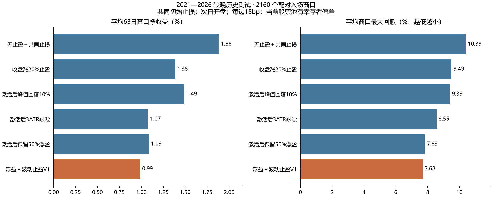

# 美股止盈指标：浮盈＋波动止盈 V1

用途：持有数周到数月的单次多头波段。状态为研究候选，历史比较不构成自动下单规则。

## 可直接计算的规则

E 是本次入场成本；H 是买入后最高收盘价（初始值 E）；A₀ 是买入前最后一根完整日线的 ATR14；Aₜ 是当日完整日线的 ATR14。

1. 当 H−E ≥ max(5%×E, 2×A₀) 时激活，此后持续激活。
2. 激活后：Lₜ = max(Lₜ₋₁, H−3×Aₜ, E+50%×(H−E))，首次激活省去前一日项。
3. 收盘价 Cₜ ≤ Lₜ 时给出退出提示，研究回测按下一真实交易日开盘成交。止盈线只上移。
4. 接近度 = clip[100×(H−C)/(H−L), 0, 100]；0 表示在峰值，100 表示触发。未激活显示空值；它不是下跌概率。

ATR14 用 Wilder 平滑：首14根真实波幅取均值，此后 (13×前ATR+当日TR)/14。TR 为日内高低差、最高价与前收盘差、最低价与前收盘差的最大值。

50%浮盈保留项在刚激活时通常比3ATR更紧，因此必须同时比较不含此项的3ATR版本。5%、2ATR、3ATR和50%均为事前设计值，没有由回测拟合为最优。

**算例（仅演示）**：成本100，入场ATR=2；峰值升至120，当日ATR=3。激活门槛为5，候选线为 max(120−9,100+10)=111；若此前线更高，则沿用更高值。收盘跌到111或以下提示退出，次日跳空可能成交更低。

## 数据与验证范围

来源：Yahoo Finance chart via data_loader.load_yahoo_daily_prices；有效证券 82 只；实际日线覆盖 2015-01-02—2026-10-02。
股票池复用项目现有80只研究证券，排除BYDDY/TCEHY两个OTC标的；SPY/QQQ/DIA/IWM单列为ETF参考。美股上市ADR仍包括在个股组，海外业务和汇率影响没有单独建模。
所有OHLC先统一复权。数据快照具有拆股/股息调整，回测收益属于复权总回报近似；实时应用必须把入场价、峰值和ATR统一到同一坐标，不能直接混用原始成本与复权线。

2016—2020为开发期，2021—数据末日为较晚测试期。跨越区间边界的完整评价窗口剔除。按时间分段可减少调参泄漏，但这些市场历史及当前股票池已经可见，不能称为盲测。

每月首个观察到的交易日，如果前日收盘>SMA50>SMA200，则当日开盘买入；共同初始风险线为E−3ATR₀，收盘触发、次日开盘退出。每组按63个完整交易日后的开盘统一评价，提前退出后现金收益为0、无重入，默认每边15基点成本。

月度窗口会重叠，这些是配对退出实验，非可执行组合；下表收益是每个63日评价窗口的平均净收益，不能年化为组合CAGR、Sharpe或资金盈利预测。回撤是窗口内资金路径最大回撤的平均值，仅采样完整收盘及入场/退出开盘，不包含盘中最深回撤。

## 较晚测试期：个股

|退出规则|样本数|平均63日净收益|中位数|10%分位收益|平均窗口回撤|平均持仓日数|
|---|---:|---:|---:|---:|---:|---:|
|无止盈＋共同止损|2160|1.88%|-4.44%|-10.31%|10.39%|42.0|
|收盘涨20%止盈|2160|1.38%|-4.39%|-10.21%|9.49%|37.6|
|激活后峰值回落10%|2160|1.49%|-3.54%|-9.47%|9.39%|37.4|
|激活后3ATR跟踪|2160|1.07%|-1.25%|-9.43%|8.55%|31.7|
|激活后保留50%浮盈|2160|1.09%|1.16%|-9.39%|7.83%|28.6|
|浮盈＋波动止盈V1|2160|0.99%|1.16%|-9.39%|7.68%|27.7|

## 与无止盈＋共同止损的配对差异

|范围|V1平均收益差（百分点）|描述性95%区间|半年度块数|
|---|---:|---:|---:|
|stocks|-0.90|[-2.03, +0.26]|12|
|references|-0.49|[-1.01, +0.14]|11|
|stocks_ex_nvda|-0.84|[-1.96, +0.30]|12|
|stocks_ex_semiconductors|-0.58|[-1.45, +0.31]|12|

**结论：V1在该测试中牺牲了平均收益。** 它只能按保护浮盈的工具评估，不能作为提高收益的推荐方案；如果追求长期趋势收益，应慎用过早收紧的盈利保留线。

在达到相同激活门槛的窗口中，最终净收益转负的比例从基准 28.06% 降至V1 5.27%。这描述了浮盈保护效果，同时仍存在亏损成交。

成本敏感性（较晚测试期个股，双边成本独立重算）：

|每边成本|无止盈平均净收益|V1平均净收益|
|---|---:|---:|
|0bp|2.19%|1.29%|
|15bp|1.88%|0.99%|
|30bp|1.58%|0.68%|

## 使用边界与可复现证据

- 只有实际盈利达到激活门槛才启动；未激活时本指标不承担亏损保护，初始风险止损需另设。
- 当前股票池回填历史，缺少退市股票和逐时成分数据，有幸存者/选择偏差；某些拆分公司历史也可能经过供应商重写。没有纳入税、真实成交量冲击、CAD汇率或现金利息。
- 接近度只显示价格位置，未验证任何分数阈值的减仓效果。该版本比较的是全部退出，不含分批止盈。
- 半年度块自助区间保留同一时期股票相关性，但样本块不多且边界仍可相互重叠，区间仅作描述性参考。
- 历史资料按提供商复权方式研究；实时落地需要持仓状态持久化、拆股与股息处理、数据新鲜度检查和人工决定，当前未接入交易面板。

复现：`python -m research.fetch_take_profit_prices` 然后 `python -m research.take_profit_backtest`。
`protocol.json`保存固定参数和区间；`prices.json`与`coverage.json`保存原始行情和缺失情况；`trades.csv`保存每笔配对结果；`summary.json`记录输入SHA256、验证、年度/证券、排除NVDA/半导体、成本和仅开发期的单参数敏感性。

输入SHA256：`45aed4d09c7b47b6bd2a3d5e20056de45c874bf8666688665dab32fb211bed9b`。

## 方法来源

ATR定义与平滑：[Fidelity ATR](https://www.fidelity.com/learning-center/trading-investing/technical-analysis/technical-indicator-guide/atr)。
波动跟踪退出的既有思路：[TradingView Chandelier Exit](https://www.tradingview.com/support/solutions/43000773013-chandelier-exit/)。本设计使用入场后的最高收盘及浮盈保留，公式与标准Chandelier不同。
止损触发价不是保证成交价：[SEC Investor Bulletin](https://www.investor.gov/introduction-investing/general-resources/news-alerts/alerts-bulletins/investor-bulletins-15)。
